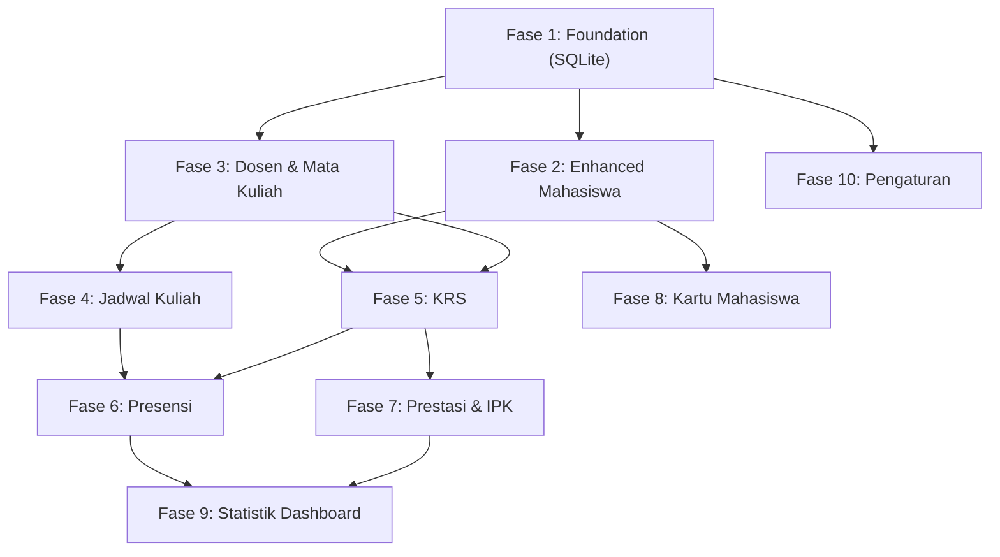

# Spesifikasi Fitur Baru (Versi 2) - Portal Akademik Universitas Buddhi Dharma

**Versi:** 2.0.0  
**Status:** Disetujui (Approved)  
**Tanggal:** 30 September 2026  

---

## 1. Ringkasan Eksekutif

Dokumen ini merupakan spesifikasi komprehensif untuk pengembangan fitur Tahap 2 (V2) dari Portal Akademik Universitas Buddhi Dharma (UBD). Pada versi ini, sistem akan mengalami perombakan arsitektur penyimpanan dari AsyncStorage menuju **expo-sqlite** untuk memastikan integritas dan relasi data yang lebih baik. Pengembangan V2 akan menambahkan modul-modul krusial akademik seperti Pengelolaan Dosen, Mata Kuliah, Jadwal Kuliah, Kartu Rencana Studi (KRS), Presensi, Penilaian, Kartu Mahasiswa Digital, hingga penyempurnaan Dashboard Statistik dan Pengaturan Aplikasi.

Seluruh pengembangan mengacu pada palet warna utama UBD (Primary Blue `#2B52BA` / `#3B62C6`, Background `#FFFFFF`) dan dibangun menggunakan React Native 0.86, Expo SDK 57, TypeScript, serta `expo-router`.

---

## 2. Keputusan Arsitektural V2

Tabel berikut memuat seluruh keputusan arsitektural yang telah disepakati untuk pengembangan V2:

| Kategori | Keputusan Arsitektural |
| --- | --- |
| **Persistensi** | Migrasi total dari `AsyncStorage` ke **expo-sqlite** (pendekatan *big bang*, mulai dengan skema baru). |
| **Navigasi** | Mempertahankan 3 *bottom tab* (Home, Data Mahasiswa, Report). Modul baru diakses sebagai **stack screens** dari *grid menu* di dalam tab Home. |
| **Semester** | Menggunakan sistem Semester Aktif tunggal yang dapat diubah oleh admin. Riwayat semester terdahulu tetap tersimpan dan dapat difilter. |
| **Grading (Penilaian)** | Menggunakan skala huruf standar: A (4.0), B+ (3.5), B (3.0), C+ (2.5), C (2.0), D (1.0), E (0.0). IPK dihitung berdasarkan bobot SKS. |
| **Presensi** | Presensi disederhanakan per pertemuan: Admin memilih mata kuliah & tanggal, melihat daftar mahasiswa sesuai KRS, dan menggunakan *toggle* Hadir/Izin/Sakit/Alpha. |
| **Kartu Mahasiswa** | Menampilkan avatar inisial gradient, Nama, NIM, Fakultas, Gender, Tahun Masuk, Status, dan QR code (berisi NIM). Tanpa fitur upload foto. |
| **Pencarian (Search)** | Diimplementasikan secara spesifik per-modul. Setiap layar daftar (*list*) memiliki *search bar* mandiri. |
| **Statistik Dashboard** | Menengah: Menampilkan *bar chart* mahasiswa per fakultas, *pie chart* gender, rata-rata IPK, rata-rata kehadiran, dan jumlah mata kuliah aktif. |
| **Edit Mahasiswa** | Data mahasiswa dapat diubah melalui form yang sudah terisi otomatis (*pre-filled*). |
| **Status Mahasiswa** | Berbasis *Enum*: Aktif, Cuti, Tidak Aktif, Lulus. Nilai *default* saat pembuatan adalah Aktif. |
| **Jadwal Kuliah** | *List view* dikelompokkan per hari (Senin–Sabtu). Hari difilter menggunakan komponen *chip* atau *tab*. |
| **KRS** | Alur: Admin memilih mahasiswa → menampilkan *checklist* mata kuliah → menyimpan pilihan. Total SKS dikalkulasi secara otomatis. |
| **CRUD Dosen & Matkul** | Implementasi *Full CRUD*. Dosen dilengkapi NIDN, Nama, Fakultas, Gender, No. Telepon. Mata Kuliah dilengkapi Kode, Nama, SKS, Fakultas, Dosen Pengampu. |
| **Pengaturan** | Disediakan layar *Settings* (ikon gear) untuk mengubah semester aktif, mereset data aplikasi, melihat info aplikasi, dan profil admin. |
| **Urutan Implementasi** | Data-first: SQLite → Enhanced Mahasiswa → Dosen & Matkul → Jadwal → KRS → Presensi → Nilai/IPK → Kartu Mahasiswa → Statistik → Pengaturan. |

---

## 3. Daftar Fitur Baru Per Modul

Berikut adalah daftar fitur yang dibagi ke dalam 10 fase pengembangan. Setiap fase dilengkapi dengan kriteria penerimaan (*Acceptance Criteria*) berbasis Gherkin.

### Fase 1: Foundation (Migrasi SQLite)
1. **Setup expo-sqlite**: Inisialisasi koneksi database lokal menggunakan `expo-sqlite`.
2. **Schema Creation**: Pembuatan tabel-tabel terelasikan untuk seluruh entitas.
3. **Migrasi Auth**: Mengubah sistem autentikasi (sesi admin) menggunakan SQLite.
4. **Migrasi Mahasiswa**: Mengubah operasi CRUD Mahasiswa untuk menggunakan database SQLite.
5. **Seed Data**: Membuat skrip *seed* awal untuk memasukkan data dummy (Semester, Dosen, Matkul, Jadwal).
6. **Hapus AsyncStorage**: Membersihkan seluruh kode lama yang masih menggunakan `AsyncStorage`.

> **Acceptance Criteria**
> *Given* aplikasi baru saja diinstal
> *When* aplikasi dijalankan pertama kali
> *Then* sistem menjalankan migrasi SQLite dan menyuntikkan data *seed* tanpa *error*
> *And* login admin berhasil dicatat dalam tabel `sessions`.

### Fase 2: Enhanced Mahasiswa
1. **Edit Mahasiswa**: Form edit dengan data terisi otomatis (*pre-filled*).
2. **Status Mahasiswa**: Penambahan *field* Status (Aktif, Cuti, Tidak Aktif, Lulus).
3. **Filter Status**: Fitur filter daftar mahasiswa berdasarkan status.
4. **Search Bar**: Kolom pencarian mandiri di halaman daftar mahasiswa.
5. **Detail View**: Halaman detail mahasiswa yang menampilkan informasi lengkap termasuk status dan fakultas.

> **Acceptance Criteria**
> *Given* admin berada di halaman Detail Mahasiswa
> *When* admin menekan tombol "Edit" dan mengubah Status menjadi "Cuti", lalu menekan "Simpan"
> *Then* sistem menyimpan perubahan ke SQLite dan memperbarui tampilan antarmuka.

### Fase 3: Dosen & Mata Kuliah
1. **CRUD Dosen**: Form tambah, edit, hapus, dan detail dosen.
2. **List & Search Dosen**: Halaman daftar dosen dengan fitur pencarian.
3. **Seed Dosen**: Penyediaan 8 data dosen fiktif.
4. **CRUD Mata Kuliah (Matkul)**: Form tambah, edit, hapus, dan detail mata kuliah beserta relasi ke dosen pengampu.
5. **List & Search Matkul**: Halaman daftar mata kuliah dengan pencarian.
6. **Seed Matkul**: Penyediaan 12 data matkul fiktif.
7. **Navigasi Grid**: Penambahan ikon "Dosen" dan "Mata Kuliah" di grid menu *Home*.

> **Acceptance Criteria**
> *Given* admin berada di form Tambah Mata Kuliah
> *When* admin mengisi Kode, Nama, SKS, Fakultas, dan memilih Dosen, lalu "Simpan"
> *Then* mata kuliah baru ditambahkan ke database dan muncul di halaman daftar.

### Fase 4: Jadwal Kuliah
1. **CRUD Jadwal**: Form penentuan hari, jam mulai, jam selesai, mata kuliah, dan ruangan.
2. **List View Per Hari**: Menampilkan daftar jadwal dalam *tab* hari (Senin-Sabtu).
3. **Search**: Pencarian nama mata kuliah atau ruangan di dalam jadwal.
4. **Validasi Bentrok**: Mencegah input jadwal jika ruangan dan waktu bentrok.
5. **Seed Jadwal**: Penyediaan 10 jadwal fiktif.
6. **Navigasi Grid**: Penambahan ikon "Jadwal" di grid menu *Home*.

> **Acceptance Criteria**
> *Given* admin berada di halaman Jadwal Kuliah
> *When* admin menekan tab "Senin"
> *Then* sistem hanya menampilkan jadwal mata kuliah pada hari Senin, diurutkan berdasarkan jam mulai.

### Fase 5: KRS (Kartu Rencana Studi)
1. **Pilih Mahasiswa**: Memilih mahasiswa sebelum mengisi KRS.
2. **Checklist Matkul**: Menampilkan daftar matkul untuk dipilih.
3. **Total SKS**: Kalkulasi otomatis penjumlahan SKS dari matkul yang dicentang.
4. **Simpan KRS**: Menyimpan entri KRS (relasi Mahasiswa, Matkul, dan Semester).
5. **Lihat KRS**: Halaman untuk melihat detail KRS mahasiswa di semester tertentu.
6. **Filter Semester**: *Dropdown* untuk melihat riwayat KRS semester lalu.
7. **Navigasi Grid**: Penambahan ikon "KRS" di grid menu *Home*.

> **Acceptance Criteria**
> *Given* admin memilih mahasiswa untuk pengisian KRS semester aktif
> *When* admin mencentang 2 mata kuliah dengan total bobot 6 SKS
> *Then* sistem menampilkan teks "Total: 6 SKS" secara langsung (*real-time*).

### Fase 6: Presensi
1. **Pilih Matkul & Tanggal**: Form awal untuk masuk ke daftar presensi.
2. **Checklist Kehadiran**: Daftar mahasiswa (berdasarkan KRS) dengan tombol Hadir, Izin, Sakit, Alpha.
3. **Simpan Presensi**: Menyimpan data kehadiran massal ke tabel `presensi`.
4. **Rekap Presensi**: Menampilkan persentase kehadiran per mahasiswa di detail KRS/Matkul.
5. **Search**: Pencarian nama mahasiswa di daftar absensi.
6. **Navigasi Grid**: Penambahan ikon "Presensi" di grid menu *Home*.

> **Acceptance Criteria**
> *Given* admin berada di daftar presensi Algoritma tanggal 10 Oktober 2026
> *When* admin mengubah status Budi dari "Hadir" menjadi "Sakit" dan menekan "Simpan"
> *Then* sistem mencatat status presensi tersebut di database SQLite.

### Fase 7: Prestasi & IPK (Nilai)
1. **Input Nilai**: Form penentuan nilai per mata kuliah untuk setiap mahasiswa di akhir semester.
2. **Konversi Huruf/Angka**: Konversi otomatis sesuai standar (A=4.0, B+=3.5, dst).
3. **Kalkulasi IPS**: Menghitung Indeks Prestasi Semester (IPS) dari nilai KRS semester aktif.
4. **Kalkulasi IPK**: Menghitung Indeks Prestasi Kumulatif (IPK) dari seluruh nilai historis.
5. **Transkrip**: Halaman yang menampilkan rekapan nilai semua semester.
6. **Distribusi Nilai**: Laporan singkat sebaran nilai untuk satu kelas/matkul.
7. **Navigasi Grid**: Penambahan ikon "Nilai" di grid menu *Home*.

> **Acceptance Criteria**
> *Given* admin menginput nilai B untuk mata kuliah Kalkulus (3 SKS) bagi Budi
> *When* perhitungan dijalankan
> *Then* sistem mengkonversi B menjadi angka 3.0 dan menambahkan beban poin 9.0 ke total kalkulasi IP.

### Fase 8: Kartu Mahasiswa Digital
1. **Pilih Mahasiswa**: Fitur pencarian/pemilihan mahasiswa.
2. **Tampilan Kartu**: Kartu berdesain *clean* (Avatar inisial gradasi, Nama, NIM, Fakultas, Gender, Tahun Masuk, Status).
3. **QR Code**: Menghasilkan kode QR otomatis berbasis NIM mahasiswa.
4. **Branding UBD**: Kartu menggunakan warna korporat Primary Blue UBD.
5. **Navigasi Grid**: Penambahan ikon "Kartu Mahasiswa" di grid menu *Home*.

> **Acceptance Criteria**
> *Given* admin membuka fitur Kartu Mahasiswa
> *When* admin memilih mahasiswa bernama "Joko Santoso" dengan NIM "123456"
> *Then* sistem merender kartu dengan inisial "JS" berlatar gradasi, dan QR Code berisi string "123456".

### Fase 9: Statistik Dashboard
1. **Enhanced Stat Cards**: Menampilkan kartu ringkasan di halaman utama.
2. **Bar Chart Fakultas**: Grafik batang untuk sebaran mahasiswa per fakultas.
3. **Pie Chart Gender**: Grafik lingkaran distribusi pria dan wanita.
4. **IPK Rata-Rata**: Menampilkan IPK global institusi/universitas.
5. **Kehadiran Rata-Rata**: Rata-rata persentase kehadiran.
6. **Matkul Aktif**: Menampilkan jumlah kelas/matkul yang berjalan.

> **Acceptance Criteria**
> *Given* admin membuka tab "Report"
> *When* data dirender
> *Then* sistem mengeksekusi kueri agregasi SQLite dan menampilkan *Bar Chart* tanpa tersendat.

### Fase 10: Pengaturan
1. **Layar Pengaturan**: Halaman berikon *gear* untuk konfigurasi sistem.
2. **Ganti Semester**: Mengatur status semester mana yang sedang berjalan (*aktif*).
3. **Reset Data**: Tombol bahaya (*danger zone*) untuk membersihkan seluruh data operasional (KRS, jadwal, nilai) kecuali konfigurasi sistem.
4. **Info App**: Menampilkan versi aplikasi (V2.0.0).
5. **Profil Admin**: Informasi admin yang sedang login.

> **Acceptance Criteria**
> *Given* admin berada di halaman Pengaturan
> *When* admin mengganti Semester Aktif ke "Genap 2025/2026"
> *Then* sistem menyimpan state dan modul KRS secara default akan menggunakan semester "Genap 2025/2026".

---

## 4. SQLite Schema

Berikut adalah pernyataan *CREATE TABLE* untuk seluruh 9 entitas yang dibutuhkan dalam sistem `expo-sqlite`, ditulis dalam sintaks TypeScript untuk file inisiasi database:

```typescript
export const schemaQueries = [
  `CREATE TABLE IF NOT EXISTS sessions (
    id INTEGER PRIMARY KEY AUTOINCREMENT,
    user_id TEXT NOT NULL,
    token TEXT NOT NULL,
    expires_at TEXT NOT NULL
  );`,

  `CREATE TABLE IF NOT EXISTS semesters (
    id INTEGER PRIMARY KEY AUTOINCREMENT,
    nama TEXT NOT NULL,
    aktif INTEGER DEFAULT 0,
    created_at TEXT NOT NULL,
    updated_at TEXT NOT NULL
  );`,

  `CREATE TABLE IF NOT EXISTS mahasiswa (
    id INTEGER PRIMARY KEY AUTOINCREMENT,
    nim TEXT UNIQUE NOT NULL,
    nama TEXT NOT NULL,
    fakultas TEXT NOT NULL,
    gender TEXT NOT NULL,
    tahun_masuk TEXT NOT NULL,
    status TEXT NOT NULL DEFAULT 'Aktif',
    created_at TEXT NOT NULL,
    updated_at TEXT NOT NULL
  );`,

  `CREATE TABLE IF NOT EXISTS dosen (
    id INTEGER PRIMARY KEY AUTOINCREMENT,
    nidn TEXT UNIQUE NOT NULL,
    nama TEXT NOT NULL,
    fakultas TEXT NOT NULL,
    gender TEXT NOT NULL,
    telepon TEXT NOT NULL,
    created_at TEXT NOT NULL,
    updated_at TEXT NOT NULL
  );`,

  `CREATE TABLE IF NOT EXISTS mata_kuliah (
    id INTEGER PRIMARY KEY AUTOINCREMENT,
    kode TEXT UNIQUE NOT NULL,
    nama TEXT NOT NULL,
    sks INTEGER NOT NULL,
    fakultas TEXT NOT NULL,
    dosen_id INTEGER,
    created_at TEXT NOT NULL,
    updated_at TEXT NOT NULL,
    FOREIGN KEY (dosen_id) REFERENCES dosen (id)
  );`,

  `CREATE TABLE IF NOT EXISTS jadwal (
    id INTEGER PRIMARY KEY AUTOINCREMENT,
    mata_kuliah_id INTEGER NOT NULL,
    hari TEXT NOT NULL,
    jam_mulai TEXT NOT NULL,
    jam_selesai TEXT NOT NULL,
    ruangan TEXT NOT NULL,
    created_at TEXT NOT NULL,
    updated_at TEXT NOT NULL,
    FOREIGN KEY (mata_kuliah_id) REFERENCES mata_kuliah (id)
  );`,

  `CREATE TABLE IF NOT EXISTS krs (
    id INTEGER PRIMARY KEY AUTOINCREMENT,
    mahasiswa_id INTEGER NOT NULL,
    semester_id INTEGER NOT NULL,
    mata_kuliah_id INTEGER NOT NULL,
    created_at TEXT NOT NULL,
    updated_at TEXT NOT NULL,
    FOREIGN KEY (mahasiswa_id) REFERENCES mahasiswa (id),
    FOREIGN KEY (semester_id) REFERENCES semesters (id),
    FOREIGN KEY (mata_kuliah_id) REFERENCES mata_kuliah (id)
  );`,

  `CREATE TABLE IF NOT EXISTS presensi (
    id INTEGER PRIMARY KEY AUTOINCREMENT,
    mata_kuliah_id INTEGER NOT NULL,
    semester_id INTEGER NOT NULL,
    tanggal TEXT NOT NULL,
    mahasiswa_id INTEGER NOT NULL,
    status_kehadiran TEXT NOT NULL,
    created_at TEXT NOT NULL,
    updated_at TEXT NOT NULL,
    FOREIGN KEY (mata_kuliah_id) REFERENCES mata_kuliah (id),
    FOREIGN KEY (semester_id) REFERENCES semesters (id),
    FOREIGN KEY (mahasiswa_id) REFERENCES mahasiswa (id)
  );`,

  `CREATE TABLE IF NOT EXISTS nilai (
    id INTEGER PRIMARY KEY AUTOINCREMENT,
    mahasiswa_id INTEGER NOT NULL,
    semester_id INTEGER NOT NULL,
    mata_kuliah_id INTEGER NOT NULL,
    nilai_huruf TEXT NOT NULL,
    nilai_angka REAL NOT NULL,
    created_at TEXT NOT NULL,
    updated_at TEXT NOT NULL,
    FOREIGN KEY (mahasiswa_id) REFERENCES mahasiswa (id),
    FOREIGN KEY (semester_id) REFERENCES semesters (id),
    FOREIGN KEY (mata_kuliah_id) REFERENCES mata_kuliah (id)
  );`
];
```

---

## 5. Peta Navigasi / Routing Baru

Struktur direktori di bawah `src/app/` menggunakan konsep `expo-router` stack navigation:

```text
src/app/
├── _layout.tsx
├── (auth)/
│   └── login.tsx
├── (tabs)/
│   ├── _layout.tsx
│   ├── home/
│   │   ├── _layout.tsx
│   │   ├── index.tsx                (Grid Dashboard)
│   │   ├── dosen/
│   │   │   ├── index.tsx            (List)
│   │   │   ├── form.tsx             (Create/Edit)
│   │   │   └── [id].tsx             (Detail)
│   │   ├── matkul/
│   │   │   ├── index.tsx
│   │   │   ├── form.tsx
│   │   │   └── [id].tsx
│   │   ├── jadwal/
│   │   │   ├── index.tsx
│   │   │   └── form.tsx
│   │   ├── krs/
│   │   │   ├── index.tsx            (Pilih Mahasiswa)
│   │   │   └── [mahasiswa_id].tsx   (Checklist & Detail SKS)
│   │   ├── presensi/
│   │   │   ├── index.tsx            (Pilih Matkul & Tanggal)
│   │   │   └── form.tsx             (Checklist Kehadiran)
│   │   ├── nilai/
│   │   │   ├── index.tsx            (Pilih Matkul)
│   │   │   └── input.tsx            (Tabel Input Nilai)
│   │   ├── kartu/
│   │   │   ├── index.tsx            (Pilih Mahasiswa)
│   │   │   └── [mahasiswa_id].tsx   (Tampilan Kartu Digital)
│   │   └── pengaturan/
│   │       └── index.tsx            (Settings Page)
│   ├── mahasiswa/
│   │   ├── _layout.tsx
│   │   ├── index.tsx                (Enhanced List)
│   │   ├── form.tsx
│   │   └── [id].tsx                 (Detail View)
│   └── report/
│       ├── _layout.tsx
│       └── index.tsx                (Dashboard Statistik Menengah)
```

---

## 6. Dependency Graph

Diagram di bawah ini mengilustrasikan ketergantungan urutan (*dependencies*) pengerjaan tiap fase.



---

## 7. Seed Data Referensi

Data *seed* berikut harus dimasukkan ke dalam database SQLite saat aplikasi diinstal pertama kali, untuk mempermudah tahap pengujian dan demonstrasi.

### Tabel Semester
1. **Ganjil 2025/2026** (Aktif)

### Tabel Dosen (8 Data)
1. **NIDN**: 0101010101 | **Nama**: Dr. Budi Santoso | **Fakultas**: Ilmu Komputer | **Gender**: Laki-laki | **Telepon**: 08111111111
2. **NIDN**: 0202020202 | **Nama**: Prof. Siti Aminah | **Fakultas**: Ilmu Komputer | **Gender**: Perempuan | **Telepon**: 08222222222
3. **NIDN**: 0303030303 | **Nama**: Ir. Agus Setiawan, M.T. | **Fakultas**: Teknik | **Gender**: Laki-laki | **Telepon**: 08333333333
4. **NIDN**: 0404040404 | **Nama**: Ratna Sari, M.Sc. | **Fakultas**: Teknik | **Gender**: Perempuan | **Telepon**: 08444444444
5. **NIDN**: 0505050505 | **Nama**: Dr. Hendra Gunawan | **Fakultas**: Ekonomi | **Gender**: Laki-laki | **Telepon**: 08555555555
6. **NIDN**: 0606060606 | **Nama**: Maya Indah, M.B.A. | **Fakultas**: Ekonomi | **Gender**: Perempuan | **Telepon**: 08666666666
7. **NIDN**: 0707070707 | **Nama**: Dr. Iwan Fals | **Fakultas**: Ilmu Komunikasi | **Gender**: Laki-laki | **Telepon**: 08777777777
8. **NIDN**: 0808080808 | **Nama**: Dr. Dian Sastro | **Fakultas**: Ilmu Komunikasi | **Gender**: Perempuan | **Telepon**: 08888888888

### Tabel Mata Kuliah (12 Data)
1. **Kode**: IF101 | **Nama**: Algoritma dan Pemrograman | **SKS**: 3 | **Fakultas**: Ilmu Komputer | **Dosen**: Dr. Budi Santoso
2. **Kode**: IF102 | **Nama**: Struktur Data | **SKS**: 3 | **Fakultas**: Ilmu Komputer | **Dosen**: Prof. Siti Aminah
3. **Kode**: IF103 | **Nama**: Basis Data | **SKS**: 3 | **Fakultas**: Ilmu Komputer | **Dosen**: Dr. Budi Santoso
4. **Kode**: TK201 | **Nama**: Fisika Dasar | **SKS**: 2 | **Fakultas**: Teknik | **Dosen**: Ir. Agus Setiawan, M.T.
5. **Kode**: TK202 | **Nama**: Kalkulus | **SKS**: 3 | **Fakultas**: Teknik | **Dosen**: Ratna Sari, M.Sc.
6. **Kode**: TK203 | **Nama**: Rangkaian Listrik | **SKS**: 3 | **Fakultas**: Teknik | **Dosen**: Ir. Agus Setiawan, M.T.
7. **Kode**: EK301 | **Nama**: Pengantar Ekonomi | **SKS**: 2 | **Fakultas**: Ekonomi | **Dosen**: Dr. Hendra Gunawan
8. **Kode**: EK302 | **Nama**: Manajemen Bisnis | **SKS**: 3 | **Fakultas**: Ekonomi | **Dosen**: Maya Indah, M.B.A.
9. **Kode**: EK303 | **Nama**: Akuntansi Dasar | **SKS**: 3 | **Fakultas**: Ekonomi | **Dosen**: Dr. Hendra Gunawan
10. **Kode**: IK401 | **Nama**: Pengantar Jurnalistik | **SKS**: 2 | **Fakultas**: Ilmu Komunikasi | **Dosen**: Dr. Iwan Fals
11. **Kode**: IK402 | **Nama**: Public Relations | **SKS**: 3 | **Fakultas**: Ilmu Komunikasi | **Dosen**: Dr. Dian Sastro
12. **Kode**: IK403 | **Nama**: Komunikasi Massa | **SKS**: 3 | **Fakultas**: Ilmu Komunikasi | **Dosen**: Dr. Iwan Fals

### Tabel Jadwal (10 Data)
1. **Hari**: Senin | **Jam**: 08:00 - 10:30 | **Ruang**: LAB-01 | **Mata Kuliah**: Algoritma dan Pemrograman
2. **Hari**: Senin | **Jam**: 13:00 - 15:30 | **Ruang**: R-101 | **Mata Kuliah**: Struktur Data
3. **Hari**: Selasa | **Jam**: 08:00 - 10:30 | **Ruang**: LAB-02 | **Mata Kuliah**: Basis Data
4. **Hari**: Selasa | **Jam**: 10:00 - 11:40 | **Ruang**: R-102 | **Mata Kuliah**: Fisika Dasar
5. **Hari**: Rabu | **Jam**: 08:00 - 10:30 | **Ruang**: R-103 | **Mata Kuliah**: Kalkulus
6. **Hari**: Rabu | **Jam**: 13:00 - 15:30 | **Ruang**: LAB-03 | **Mata Kuliah**: Rangkaian Listrik
7. **Hari**: Kamis | **Jam**: 08:00 - 09:40 | **Ruang**: R-201 | **Mata Kuliah**: Pengantar Ekonomi
8. **Hari**: Kamis | **Jam**: 10:00 - 12:30 | **Ruang**: R-202 | **Mata Kuliah**: Manajemen Bisnis
9. **Hari**: Jumat | **Jam**: 08:00 - 10:30 | **Ruang**: R-301 | **Mata Kuliah**: Pengantar Jurnalistik
10. **Hari**: Jumat | **Jam**: 13:00 - 15:30 | **Ruang**: R-302 | **Mata Kuliah**: Public Relations

---

## 8. Glossary Terms Baru

Berikut adalah 10 istilah spesifik baru yang menjadi acuan konvensi (*Glossary*) dalam portal ini:

1. **Dosen**: Tenaga pendidik di lingkungan Universitas Buddhi Dharma.
2. **NIDN**: Nomor Induk Dosen Nasional, pengidentifikasi unik sepanjang 10 digit bagi Dosen.
3. **Mata Kuliah**: Satuan pelajaran yang memiliki kode khusus dan beban SKS.
4. **SKS**: Satuan Kredit Semester, bobot waktu dan penilaian sebuah Mata Kuliah.
5. **KRS**: Kartu Rencana Studi, rekaman pengambilan Mata Kuliah oleh seorang Mahasiswa dalam satu Semester tertentu.
6. **Presensi**: Kegiatan rekapitulasi tingkat kehadiran Mahasiswa dalam mengikuti jadwal Mata Kuliah.
7. **IPS**: Indeks Prestasi Semester, rata-rata tertimbang dari nilai akhir seluruh Mata Kuliah pada satu Semester.
8. **IPK**: Indeks Prestasi Kumulatif, rata-rata tertimbang nilai dari seluruh Semester yang telah ditempuh Mahasiswa.
9. **Semester**: Periode akademik waktu pelaksanaan perkuliahan, biasanya berlabel "Ganjil" atau "Genap" beserta tahun ajaran.
10. **Nilai**: Hasil evaluasi akhir mahasiswa dalam bentuk huruf (A, B+, B, C+, C, D, E) dan padanan numeriknya (4.0 - 0.0).

---

## 9. Total Ringkasan

Tabel di bawah ini membandingkan skala lingkup proyek V1 (Baseline) dan V2:

| Aspek | V1 (Baseline) | V2 (Baru) |
| --- | --- | --- |
| **Persistensi Data** | `AsyncStorage` (JSON murni) | `expo-sqlite` (Relasional) |
| **Jumlah Tabel / Entitas** | 2 (Auth/Session, Mahasiswa) | 9 (Semesters, Mahasiswa, Dosen, Matkul, Jadwal, KRS, Presensi, Nilai, Sessions) |
| **Jumlah Fase Ekspansi** | 0 | 10 Fase Pengerjaan |
| **Layar Utama (Screens)** | ~5 Layar | ~20 Layar Tambahan |
| **Fitur Mahasiswa** | CRUD Dasar | CRUD Enhanced, Filter, Status, Search |
| **Kartu Tanda Mahasiswa** | Tidak Ada | Ada (Digital, Gradient, QR Code NIM) |
| **Laporan & Dashboard** | Sederhana (Jumlah Mahasiswa) | Menengah (Bar Chart, Pie Chart, Aggregation, Rata-rata IPK & Presensi) |
| **Fitur Akademik Inti** | Belum Ada | KRS, Presensi, Penilaian (IPK/IPS), Jadwal, Dosen, Mata Kuliah |
| **Konfigurasi** | Tidak Ada | Halaman Pengaturan (Reset Data, Ganti Semester) |
