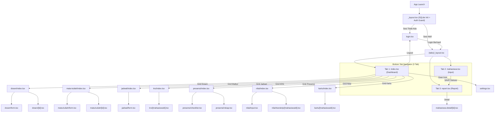
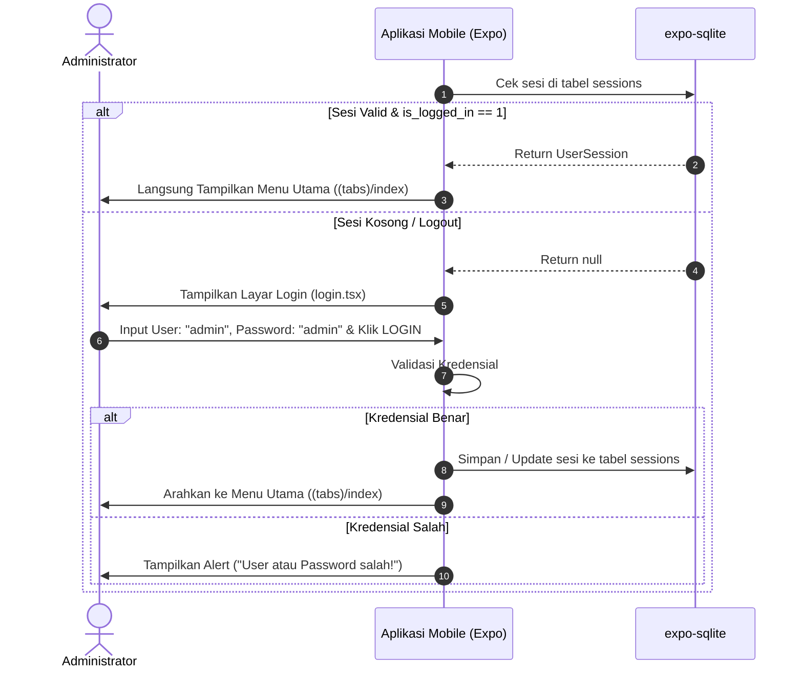
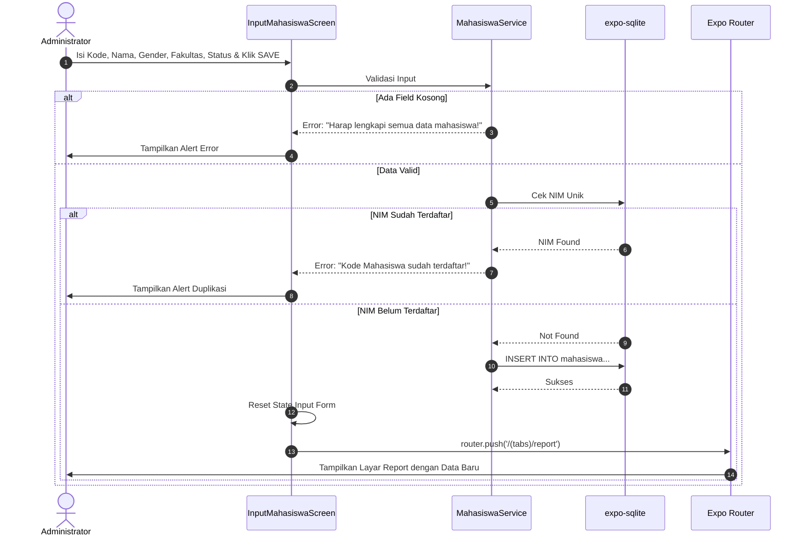
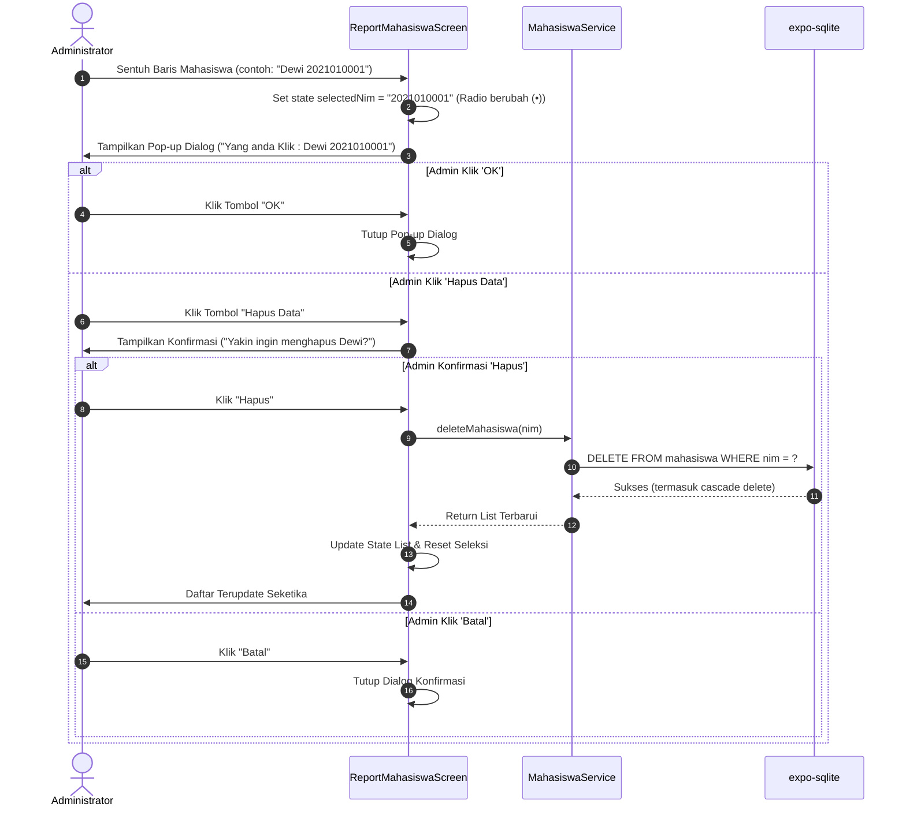
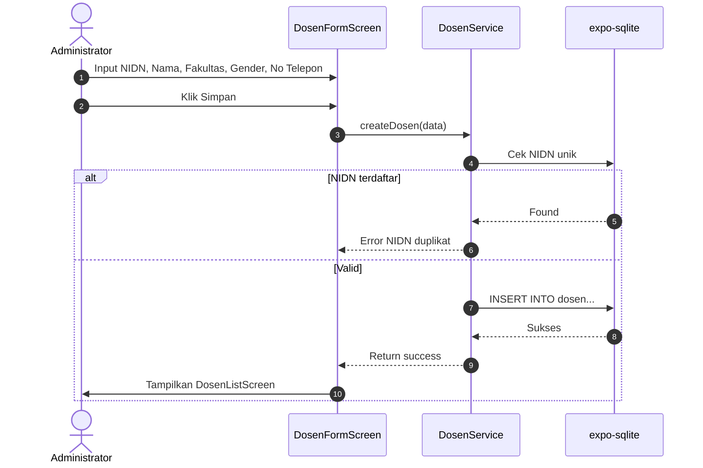
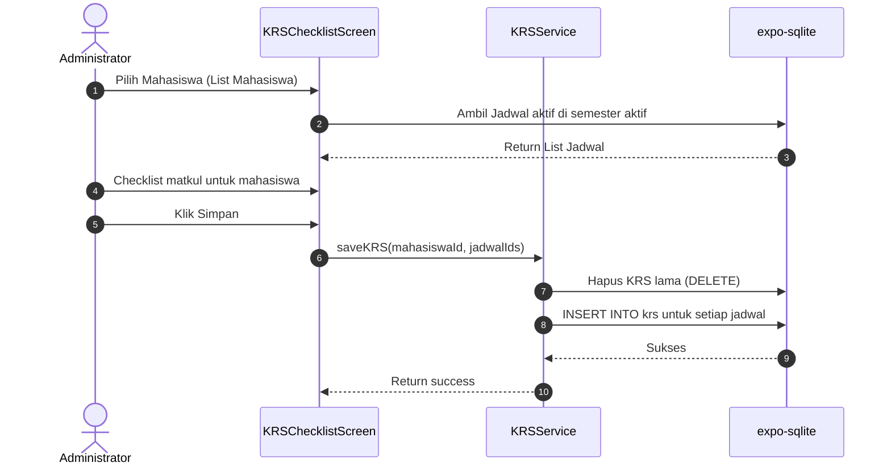
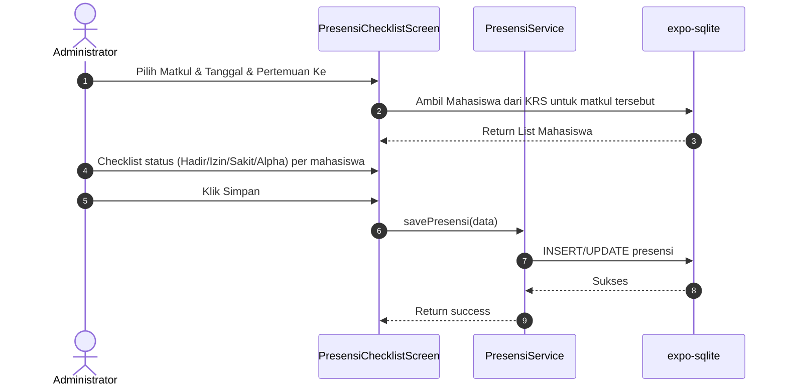
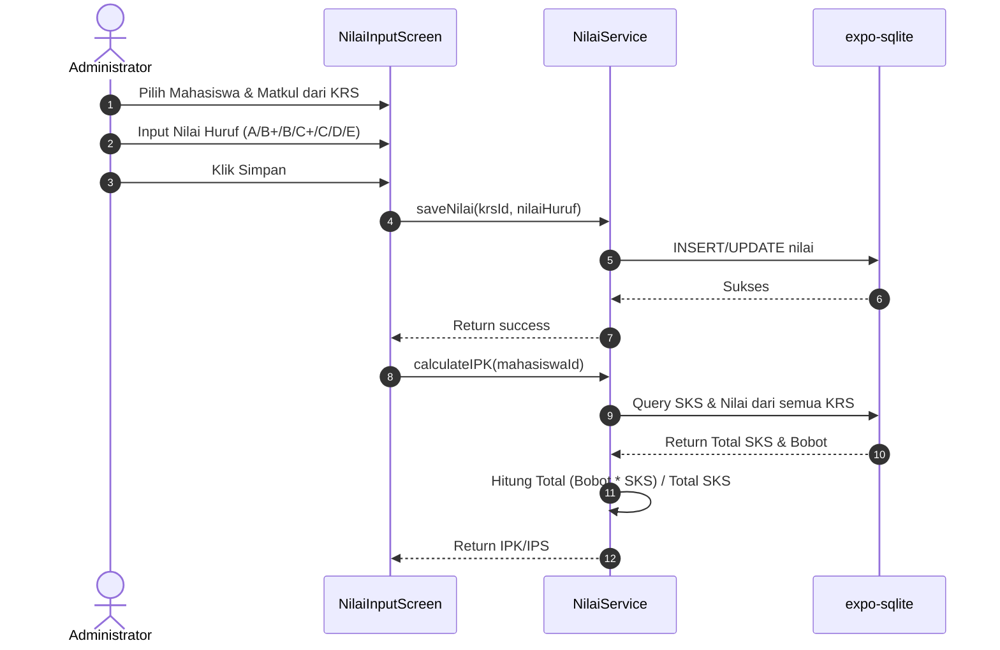
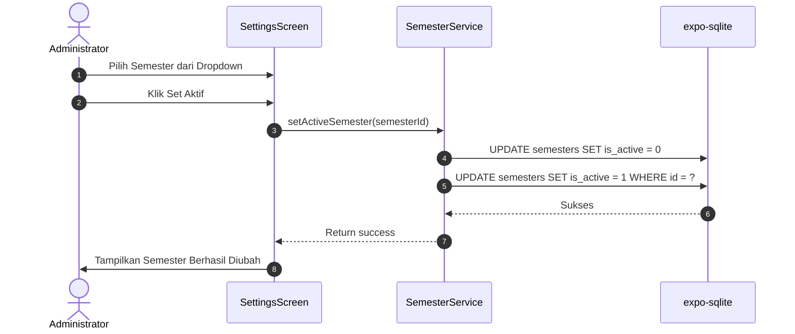

# SYSTEM DESIGN: Desain Arsitektur & Spesifikasi Sistem
## Mobile Portal Akademik Universitas Buddhi Dharma (UBD)

Dokumen ini menyajikan rancangan arsitektur teknis, diagram alir, struktur komponen, model data, serta strategi implementasi sistem aplikasi mobile Portal Akademik UBD.

---

## 1. Arsitektur Tingkat Tinggi (High-Level Architecture)

Aplikasi dibangun menggunakan pola arsitektur berlapis (*Layered Client Architecture*):

```text
+-------------------------------------------------------------+
|                     PRESENTATION LAYER                      |
|  - LoginScreen         - HomeScreen (Menu Utama)            |
|  - InputMahasiswaScreen - ReportMahasiswaScreen             |
|  - DosenListScreen, DosenFormScreen                         |
|  - MataKuliahListScreen, MataKuliahFormScreen               |
|  - JadwalScreen, JadwalFormScreen                           |
|  - KRSScreen, KRSChecklistScreen                            |
|  - PresensiScreen, PresensiChecklistScreen, PresensiRekapScreen |
|  - NilaiScreen, NilaiInputScreen, TranskripScreen           |
|  - KartuMahasiswaScreen, SettingsScreen                     |
|  - Reusable UI Components (Header, Radio, Picker, Banner)   |
+-------------------------------------------------------------+
                              |
+-------------------------------------------------------------+
|                      NAVIGATION LAYER                       |
|  - Expo Router v57 (File-based Routing)                     |
|  - Root Stack Navigator (Auth Guard / SQLite Init)          |
|  - Bottom Tabs Navigator ((tabs)/_layout.tsx)               |
|  - Stack Navigators untuk masing-masing modul               |
+-------------------------------------------------------------+
                              |
+-------------------------------------------------------------+
|                    SERVICE / DOMAIN LAYER                   |
|  - AuthService (Login, Logout, Session Validator)           |
|  - MahasiswaService (CRUD, Validation)                      |
|  - DosenService, MataKuliahService, JadwalService           |
|  - KRSService, PresensiService, NilaiService                |
|  - SemesterService, StatistikService                        |
+-------------------------------------------------------------+
                              |
+-------------------------------------------------------------+
|                   DATA PERSISTENCE LAYER                    |
|  - expo-sqlite                                              |
|  - Tables: sessions, semesters, mahasiswa, dosen,           |
|    mata_kuliah, jadwal, krs, presensi, nilai                |
+-------------------------------------------------------------+
```

---

## 2. Matriks Tumpukan Teknologi (Technology Stack)

| Komponen | Pilihan Teknologi | Versi | Alasan Pemilihan |
|---|---|---|---|
| **Core Framework** | React Native / Expo | Expo ~57.0.26 / RN 0.86.3 | Standar industri ekosistem mobile, performa native tinggi, dukungan lintas platform. |
| **Routing & Navigasi** | Expo Router | ~57.0.24 | Berbasis sistem berkas (*file-based*), integrasi native tabs dan stack yang mulus. |
| **Penyimpanan Lokal** | expo-sqlite | `expo-sqlite` | Mendukung relasi antar tabel (foreign keys), query SQL kompleks, dan performa tinggi untuk dataset akademik berelasi. |
| **Bahasa Pemrograman** | TypeScript | ~6.0.3 | Menjamin *type safety*, meminimalkan runtime error, memudahkan kolaborasi AI dan developer. |
| **Ikonografi** | `@expo/vector-icons` | Ionicons / MaterialIcons | Menyediakan ikon akademik (toga, buku, piala, kartu, rumah) berkualitas vektor tajam. |
| **Visualisasi Data** | Custom Views + react-native-svg | - | Untuk chart statistik dashboard (bar chart, pie chart) |
| **QR Code** | react-native-qrcode-svg | - | Untuk generate QR code pada Kartu Mahasiswa Digital |

---

## 3. Peta Navigasi & Struktur Rute (Route Hierarchy)

Navigasi diatur menggunakan Expo Router di dalam direktori `src/app/`:



---

## 4. Model Data & Kontrak Tipe (Data Contracts)

File kontrak tipe untuk sistem V2 didefinisikan sebagai berikut:

```typescript
/**
 * Pilihan Jenis Kelamin resmi
 */
export type Gender = 'PRIA' | 'WANITA';

/**
 * Pilihan Fakultas resmi Universitas Buddhi Dharma
 */
export type Fakultas =
  | 'Sains dan Teknologi'
  | 'Bisnis'
  | 'Ilmu Komunikasi dan Desain'
  | 'Sosial dan Humaniora';

export const FAKULTAS_OPTIONS: Fakultas[] = [
  'Sains dan Teknologi',
  'Bisnis',
  'Ilmu Komunikasi dan Desain',
  'Sosial dan Humaniora',
];

export type StatusMahasiswa = 'Aktif' | 'Cuti' | 'Tidak Aktif' | 'Lulus';

export type Hari = 'Senin' | 'Selasa' | 'Rabu' | 'Kamis' | 'Jumat' | 'Sabtu';

export type NilaiHuruf = 'A' | 'B+' | 'B' | 'C+' | 'C' | 'D' | 'E';

export type StatusPresensi = 'Hadir' | 'Izin' | 'Sakit' | 'Alpha';

export const NILAI_BOBOT: Record<NilaiHuruf, number> = {
  'A': 4.0, 'B+': 3.5, 'B': 3.0, 'C+': 2.5, 'C': 2.0, 'D': 1.0, 'E': 0.0,
};

export interface Semester {
  id: string;
  nama: string; // e.g., 'Ganjil 2023/2024'
  isActive: boolean;
}

export interface Mahasiswa {
  id: string;
  nim: string;
  nama: string;
  jenisKelamin: Gender;
  fakultas: Fakultas;
  status: StatusMahasiswa;
  createdAt: number;
}

export interface Dosen {
  id: string;
  nidn: string;
  nama: string;
  fakultas: Fakultas;
  jenisKelamin: Gender;
  noTelepon: string;
  createdAt: number;
}

export interface MataKuliah {
  id: string;
  kodeMk: string;
  nama: string;
  sks: number;
  fakultas: Fakultas;
  dosenId: string;
  createdAt: number;
}

export interface Jadwal {
  id: string;
  mataKuliahId: string;
  semesterId: string;
  hari: Hari;
  jamMulai: string;
  jamSelesai: string;
  ruangan: string;
  createdAt: number;
}

export interface KRS {
  id: string;
  mahasiswaId: string;
  jadwalId: string;
  semesterId: string;
  createdAt: number;
}

export interface Presensi {
  id: string;
  krsId: string;
  tanggal: string;
  pertemuanKe: number;
  status: StatusPresensi;
  createdAt: number;
}

export interface Nilai {
  id: string;
  krsId: string;
  nilaiHuruf: NilaiHuruf;
  createdAt: number;
}

export interface UserSession {
  username: string;
  isLoggedIn: boolean;
  loginTime: number;
}

export const DATABASE = {
  NAME: 'portal_akademik_ubd.db',
  VERSION: 1,
} as const;
```

### Skema Tabel SQLite (SQL DDL)

```sql
CREATE TABLE IF NOT EXISTS sessions (
    id TEXT PRIMARY KEY,
    username TEXT NOT NULL,
    is_logged_in INTEGER NOT NULL,
    login_time INTEGER NOT NULL
);

CREATE TABLE IF NOT EXISTS semesters (
    id TEXT PRIMARY KEY,
    nama TEXT NOT NULL,
    is_active INTEGER NOT NULL DEFAULT 0
);

CREATE TABLE IF NOT EXISTS mahasiswa (
    id TEXT PRIMARY KEY,
    nim TEXT UNIQUE NOT NULL,
    nama TEXT NOT NULL,
    jenis_kelamin TEXT NOT NULL,
    fakultas TEXT NOT NULL,
    status TEXT NOT NULL,
    created_at INTEGER NOT NULL
);

CREATE TABLE IF NOT EXISTS dosen (
    id TEXT PRIMARY KEY,
    nidn TEXT UNIQUE NOT NULL,
    nama TEXT NOT NULL,
    fakultas TEXT NOT NULL,
    jenis_kelamin TEXT NOT NULL,
    no_telepon TEXT NOT NULL,
    created_at INTEGER NOT NULL
);

CREATE TABLE IF NOT EXISTS mata_kuliah (
    id TEXT PRIMARY KEY,
    kode_mk TEXT UNIQUE NOT NULL,
    nama TEXT NOT NULL,
    sks INTEGER NOT NULL CHECK(sks >= 1 AND sks <= 6),
    fakultas TEXT NOT NULL,
    dosen_id TEXT NOT NULL,
    created_at INTEGER NOT NULL,
    FOREIGN KEY (dosen_id) REFERENCES dosen(id) ON DELETE RESTRICT
);

CREATE TABLE IF NOT EXISTS jadwal (
    id TEXT PRIMARY KEY,
    mata_kuliah_id TEXT NOT NULL,
    semester_id TEXT NOT NULL,
    hari TEXT NOT NULL,
    jam_mulai TEXT NOT NULL,
    jam_selesai TEXT NOT NULL,
    ruangan TEXT NOT NULL,
    created_at INTEGER NOT NULL,
    FOREIGN KEY (mata_kuliah_id) REFERENCES mata_kuliah(id) ON DELETE RESTRICT,
    FOREIGN KEY (semester_id) REFERENCES semesters(id) ON DELETE RESTRICT
);

CREATE TABLE IF NOT EXISTS krs (
    id TEXT PRIMARY KEY,
    mahasiswa_id TEXT NOT NULL,
    jadwal_id TEXT NOT NULL,
    semester_id TEXT NOT NULL,
    created_at INTEGER NOT NULL,
    FOREIGN KEY (mahasiswa_id) REFERENCES mahasiswa(id) ON DELETE CASCADE,
    FOREIGN KEY (jadwal_id) REFERENCES jadwal(id) ON DELETE CASCADE,
    FOREIGN KEY (semester_id) REFERENCES semesters(id) ON DELETE CASCADE
);

CREATE TABLE IF NOT EXISTS presensi (
    id TEXT PRIMARY KEY,
    krs_id TEXT NOT NULL,
    tanggal TEXT NOT NULL,
    pertemuan_ke INTEGER NOT NULL,
    status TEXT NOT NULL,
    created_at INTEGER NOT NULL,
    FOREIGN KEY (krs_id) REFERENCES krs(id) ON DELETE CASCADE
);

CREATE TABLE IF NOT EXISTS nilai (
    id TEXT PRIMARY KEY,
    krs_id TEXT NOT NULL,
    nilai_huruf TEXT NOT NULL,
    created_at INTEGER NOT NULL,
    FOREIGN KEY (krs_id) REFERENCES krs(id) ON DELETE CASCADE
);
```

---

## 5. Hierarki Komponen Antarmuka (UI Component Hierarchy)

```mermaid
graph TD
    Root["App Root (_layout.tsx)"] --> AuthContext["AuthProvider / SessionProvider"]
    
    AuthContext --> LoginScreen["LoginScreen (login.tsx)"]
    LoginScreen --> UBDHeader1["UBDHeader (Logo & Motto)"]
    LoginScreen --> LoginForm["LoginForm (User, Password, Button, SignupLink)"]
    
    AuthContext --> TabsLayout["TabsLayout ((tabs)/_layout.tsx)"]
    
    TabsLayout --> HomeScreen["HomeScreen (index.tsx)"]
    HomeScreen --> UBDHeader2["UBDHeader (dengan Logout Button)"]
    HomeScreen --> BannerGIF["BannerGIF (Container Animasi Kampus)"]
    HomeScreen --> MenuGrid["MenuGrid (Modul Akademik)"]
    
    TabsLayout --> InputScreen["InputMahasiswaScreen (mahasiswa.tsx)"]
    InputScreen --> UBDHeader3["UBDHeader"]
    InputScreen --> InputForm["Form Container"]
    InputForm --> TextInputKode["TextInput (Kode Mahasiswa)"]
    InputForm --> TextInputNama["TextInput (Nama Mahasiswa)"]
    InputForm --> RadioGroupGender["RadioGroup (PRIA / WANITA)"]
    InputForm --> DropdownFakultas["DropdownPicker (Pilihan Fakultas)"]
    InputForm --> SaveButton["Button (SAVE)"]
    
    TabsLayout --> ReportScreen["ReportMahasiswaScreen (report.tsx)"]
    ReportScreen --> UBDHeader4["UBDHeader"]
    ReportScreen --> MahasiswaFlatList["FlatList Mahasiswa"]
    MahasiswaFlatList --> MahasiswaRowItem["MahasiswaRowItem (Radio + Nama & NIM)"]
    ReportScreen --> InteractiveDialog["Modal Alert (Yang anda Klik / Hapus Data)"]

    HomeScreen --> DosenModule["Dosen Screens"]
    HomeScreen --> MataKuliahModule["Mata Kuliah Screens"]
    HomeScreen --> JadwalModule["Jadwal Screens"]
    HomeScreen --> KRSModule["KRS Screens"]
    HomeScreen --> PresensiModule["Presensi Screens"]
    HomeScreen --> NilaiModule["Nilai Screens"]
    HomeScreen --> KartuModule["Kartu Mahasiswa Screens"]
    HomeScreen --> SettingsModule["Settings Screen"]
```



---

## 6. Diagram Alir Sistem (Sequence Diagrams)

### 6.1 Alur Autentikasi & Bootstrap Sesi


### 6.2 Alur Input & Penyimpanan Data Mahasiswa


### 6.3 Alur Klik Baris Report, Alert & Penghapusan


### 6.4 Alur CRUD Dosen


### 6.5 Alur KRS


### 6.6 Alur Presensi


### 6.7 Alur Input Nilai & Kalkulasi IPK


### 6.8 Alur Ganti Semester Aktif


---

## 7. Strategi Penanganan Masalah & Kasus Tepi (Edge Cases)

1. **Inisialisasi Pertama Kali (*First Run Experience*)**:
   - Jika tabel belum ada, sistem otomatis membuat struktur tabel SQLite di layout root dan melakukan injeksi data master (fakultas, dll) jika dibutuhkan.
2. **Karakter Khusus pada NIM & Nama**:
   - Fungsi input membersihkan *leading/trailing whitespace* secara otomatis (`.trim()`) untuk mencegah spasi tak sengaja membuat validasi lolos.
3. **Ukuran Layar Kecil (Small Screens) & Scrolling**:
   - Seluruh form dibungkus dalam `KeyboardAvoidingView` dan `ScrollView` agar keyboard virtual tidak menutupi input field atau tombol SAVE.
4. **Platform Web vs Mobile**:
   - Expo Router dan `expo-sqlite` perlu penanganan khusus jika dijalankan di web. Dokumentasi ini berfokus pada implementasi mobile native (iOS/Android) untuk SQLite.
5. **Integritas Referensial**:
   - Dosen yang masih mengampu matkul tidak bisa dihapus (ON DELETE RESTRICT). Matkul yang masih punya KRS/presensi/nilai tidak bisa dihapus.
6. **Semester Historis**:
   - Saat semester aktif berganti, data lama tetap bisa diakses via filter dropdown di layar yang mendukung riwayat (seperti Transkrip atau Rekap Presensi).
7. **Cascade Logic**:
   - Saat mahasiswa dihapus, semua KRS, presensi, dan nilai terkait juga terhapus secara otomatis pada level basis data (ON DELETE CASCADE).
8. **Validasi Bentrok Jadwal**:
   - Dilakukan query SQLite untuk cek overlap jam pada hari & ruangan yang sama sebelum menyimpan jadwal baru.
9. **IPK Kosong**:
   - Jika mahasiswa belum punya nilai satupun, IPK ditampilkan sebagai "-" bukan 0.00 untuk membedakan antara nilai E semua dan belum ada nilai.
